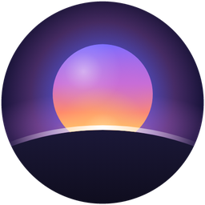
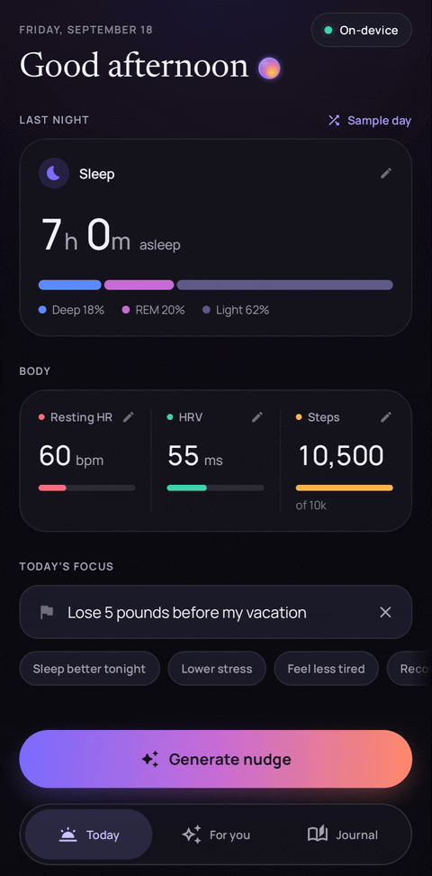
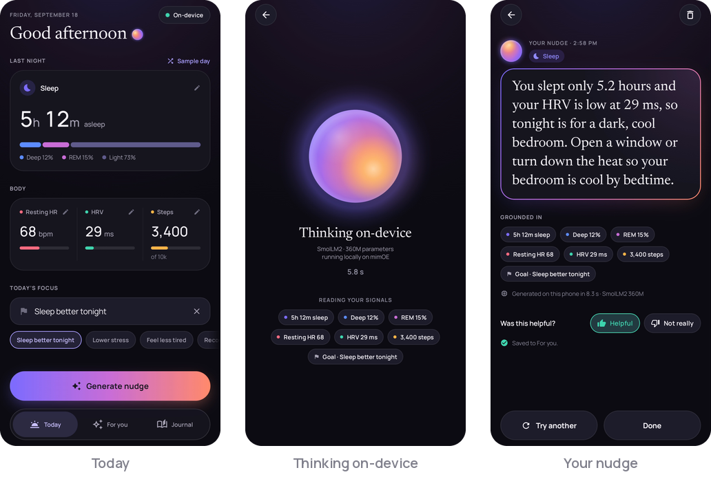
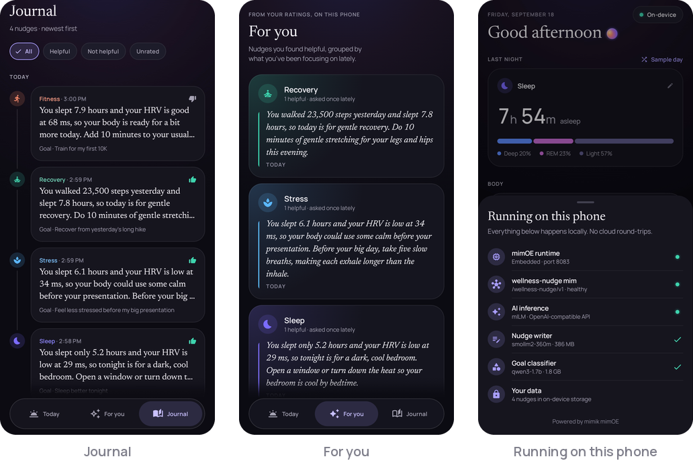
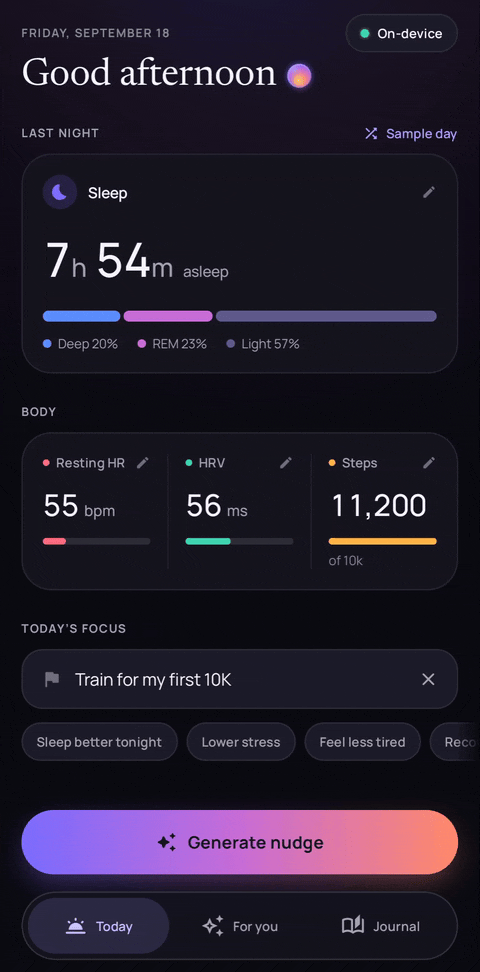
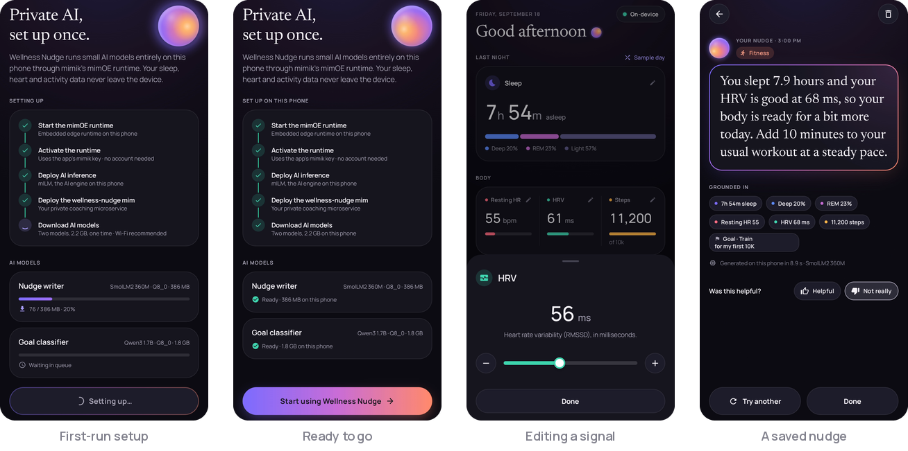
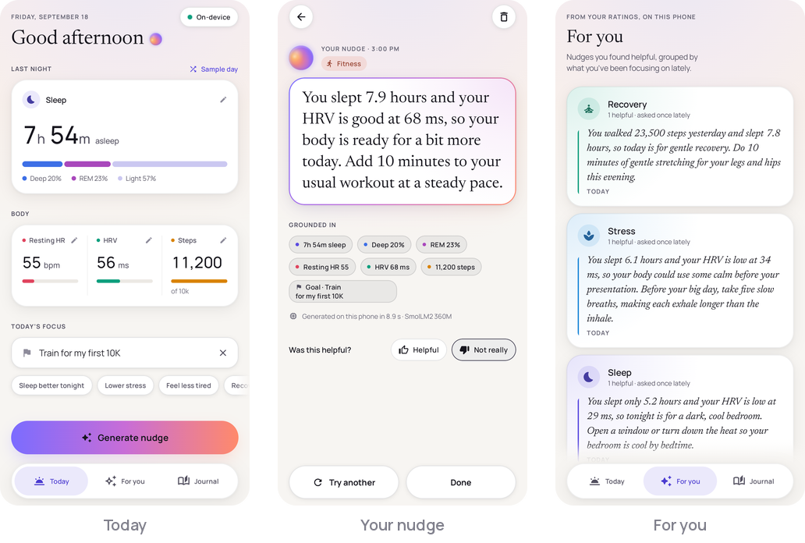
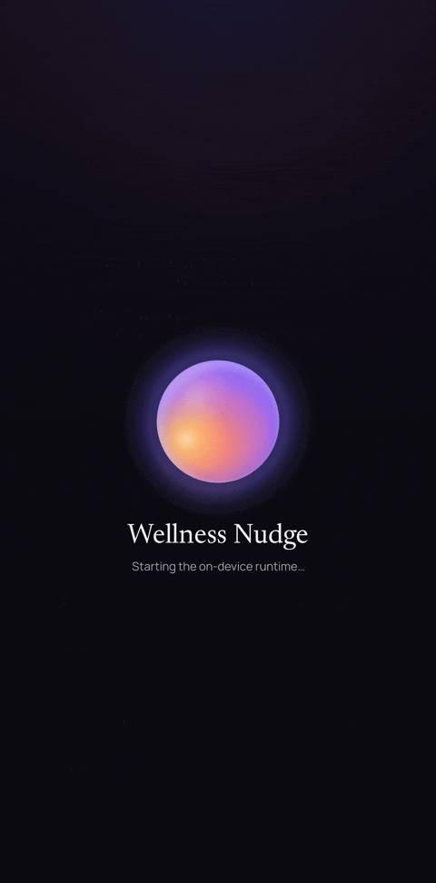
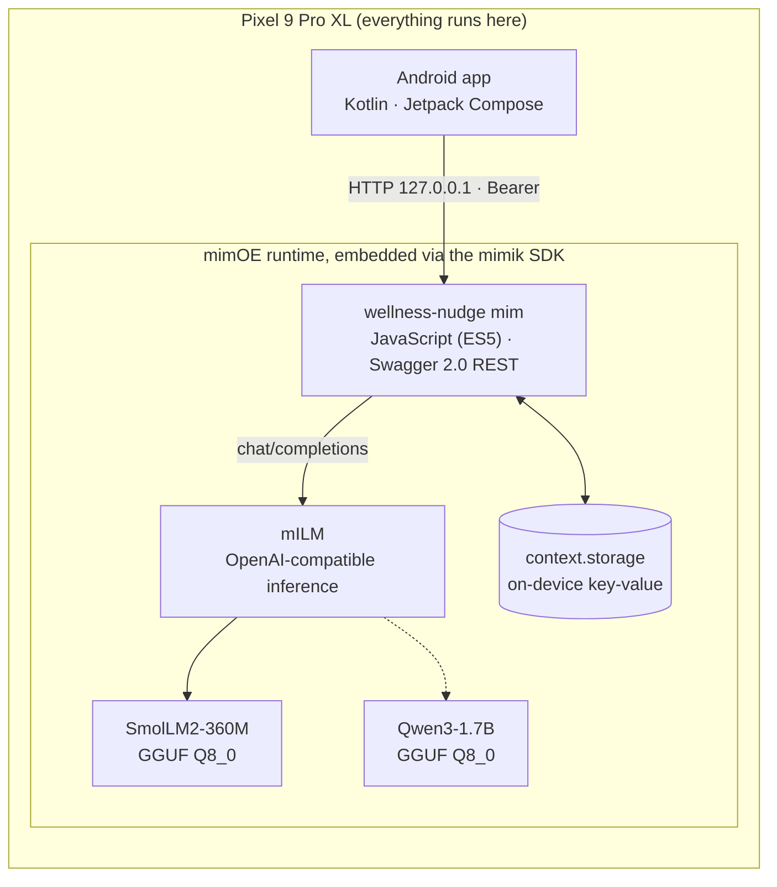

<div align="center">



# Wellness Nudge

**A private AI wellness coach that runs entirely on your phone.**<br/>
Last night's sleep, heart and activity signals go in; one small, practical nudge for today comes out.




<sub>A real, unedited capture from a Pixel 9 Pro XL. The nudge is written live by SmolLM2-360M running on the phone;<br/>the timer shows the actual on-device time.</sub>

</div>

Wellness Nudge is built on [mimik mimOE](https://mimik.com/), an edge runtime that lets microservices and AI models run on the device itself.
The Android app (Kotlin, Jetpack Compose) boots mimOE inside its own process, deploys a Swagger-driven JavaScript microservice
(a **mim**) next to mimik's inference service, and then talks to its own REST API over `127.0.0.1`. The model, the prompt, the history and
your feedback all live on the phone.

## Highlights

- **On-device inference.** SmolLM2-360M-Instruct (GGUF, Q8_0) is served by mimik's mILM through an OpenAI-compatible API. After the one-time model download the app works in airplane mode.
- **Grounded, not generic.** Code turns the raw metrics into plain language and a computed summary ("short sleep, low HRV"), and a worked example matched to the goal shows the 360M model the shape of a good nudge. Outputs passing a grounding rubric (cites a real input number, invents none, two sentences, one sensible action) went from **1% to 99%** of evaluation runs ([details](#making-a-360m-model-useful)).
- **A real design system.** "Daybreak" is a dark-first luminous UI with a matching light theme, bundled Newsreader and Manrope type, and an animated Canvas-drawn orb that stands for the AI. Motion respects reduced-motion settings, and every screen state is covered by **63 Paparazzi snapshot tests** in both themes (126 images), alongside 65 JVM unit tests.
- **Full stack on one device.** The app starts the embedded runtime, signs in, deploys two microservices, downloads the models, then uses its own API.

## Screens





<table><tr>
<td width="300"></td>
<td>

**Journal** keeps every nudge on the phone, grouped by day, with the goal and your rating; filters narrow it to helpful or unrated ones.

**For you** gathers the nudges you rated helpful, grouped by the goals you've been focusing on lately, so the advice that worked is easy to find again.

**Running on this phone**, behind the *On-device* pill, shows the live stack: the mimOE runtime, the wellness-nudge mim, mILM, both models and how many nudges are stored.

<sub>Captured at 1.5× speed.</sub>
</td>
</tr></table>



### Light theme



<sub>Every screenshot and animation is a device capture from a Pixel 9 Pro XL with the status bar cropped out; all nudges were generated on the phone.</sub>

### First run

<table><tr>
<td width="300"></td>
<td>

The first launch brings the whole stack up on the phone and shows each step as it happens:

1. start the embedded **mimOE** runtime,
2. activate it with the app's mimik credentials,
3. deploy **mILM**, mimik's inference mim,
4. deploy this project's **wellness-nudge** mim,
5. download both models from Hugging Face: SmolLM2-360M (386 MB) and Qwen3-1.7B (1.8 GB).

Later launches skip straight to Today. If the deployed mim's bundle hash matches the one in the APK and its `/healthcheck` answers, the app skips sign-in and deployment, so it works offline.

<sub>Captured at 8× speed; the real download took about 2.5 minutes on home Wi-Fi.</sub>
</td>
</tr></table>

## How it works



**Generate** posts the signals and goal to `POST /wellness-nudge/v1/nudge`. The mim sanitizes the input and classifies the goal into one of nine
wellness categories. It then builds the prompt, calls mILM and cleans up the output. Finally it stores the record in `context.storage`, together with its
on-device inference time, and returns it. **Journal** lists stored nudges; **Helpful / Not really** writes feedback; **For you** groups the nudges
you found helpful by the goals you've been focusing on lately.

### The mim's API (`/wellness-nudge/v1`)

| Method | Path | Purpose |
|---|---|---|
| GET | `/healthcheck` | liveness probe |
| POST | `/nudge` | generate, classify and store a nudge from any subset of `sleepHours`, `deepSleepPct`, `remSleepPct`, `restingHR`, `hrvMs`, `stepsYesterday`, `userGoal` |
| GET | `/history?limit=` | stored nudges, newest first |
| PUT | `/nudges/{id}/feedback` | `{"helpful": "yes" \| "no" \| "unset"}` |
| POST | `/nudges/{id}/clear` | delete a nudge |
| GET | `/tips` | helpful nudges grouped by recent focus category |

[`config/swagger.yml`](config/swagger.yml) is the source of truth; routing and request validation are generated from it at build time.

mims run in mimOE's lightweight ES5 JavaScript engine (Duktape), not Node.js. Every request gets a fresh, stateless instance, with no Node built-ins,
no `fetch` and no sockets. Outbound HTTP goes through `context.http` and persistence through `context.storage`, and requests time out after 30 s.
Webpack and Babel compile modern source to a single ES5 bundle, with targeted polyfills.

## Making a 360M model useful

The first version sent the metrics as JSON and asked the model to "reference at least one signal". On an evaluation set it almost never did: its
advice was generic ("aim for 7–8 hours of sleep") and ran long. The rewrite splits the work between code and the model:

- **Code does the reasoning a 360M model can't.** It rounds values, writes them as plain lines, and adds a computed summary:
  `Summary: short sleep, low HRV, quiet day yesterday.`
- **One worked example**, a user and assistant turn picked by goal category, shows the exact shape of a good nudge. The example's numbers
  come from the same band as the user's, and it only mentions the fields the user sent, so there is nothing to copy wrongly. Each category has three example
  answers that rotate per call, so **Try another** gets a genuinely different suggestion.
- **Output cleanup** keeps two sentences, strips runtime tokens and markdown, and repairs an HRV word that contradicts the real value.

Every candidate was scored on the same GGUF under llama.cpp, then the demo scenarios were checked on the phone.

| Prompt | Runs | Cites a real number | Passes the rubric\* |
|---|---|---|---|
| Original (temperature 0.4) | 90 | 3% | 1% |
| Final (temperature 0.2) | 90 | 100% | 100% |
| Final with rotating examples, every variant forced | 2,107 | – | 98.9% |

<sub>\* Automatic checks (cites an input number correctly, invents none, one or two sentences, no preamble, lists or medical wording) plus
semantic checks (no reading that contradicts the numbers, no "push harder" after a poor night, no action that works against the goal).</sub>

The harness is in [`tools/prompt-eval/`](tools/prompt-eval/).

## Design


**Daybreak** treats the on-device AI as a light source. The canvas is deep ink, or warm "morning paper" in the light theme, and the sunrise gradient
(iris, orchid, coral, honey) is reserved for AI moments: the orb, the Generate button, the nudge card and model downloads. Everything else stays quiet.

- **One hero per screen.** Today builds toward Generate, and on the Nudge screen the text is set large in Newsreader, the voice of the product.
- **Honest numbers.** The app only shows values the person entered, with no invented trends or scores. The sleep card moves in 6-minute steps so that "5h 12m" on the card and "5.2 hours" in the nudge always agree.
- **Private by design, visibly.** An *On-device* pill opens a sheet listing what runs where: the runtime, the mim, the models and how many nudges are stored.
- **Performance is part of the design.** The thinking orb used to redraw every frame at 120 Hz, and on the phone that competed with the model for the CPU. The same request took 12.0–12.6 s from the app against 6.7–8.9 s from a static screen. Drawing the orb at 30 fps closed most of the gap.

The component gallery above is rendered by the app's own snapshot tests. Design notes are in [`docs/design.md`](docs/design.md).

## Tech stack

| Layer | Stack |
|---|---|
| Android app | Kotlin 2.0, Jetpack Compose (Material 3), Navigation Compose, ViewModel + StateFlow, Retrofit/OkHttp, Coroutines, SplashScreen API, edge-to-edge |
| Testing | Paparazzi snapshot tests (every screen and state, light and dark), JVM unit tests for the repository, formatters and screen logic |
| Microservice | JavaScript compiled to ES5, Swagger 2.0 codegen (`@mimik/swagger-mw-codegen`), Webpack 5, Babel, ESLint |
| Runtime | mimik mimOE (embedded Android SDK), mILM inference mim, `context.storage` |
| Models | SmolLM2-360M-Instruct writes nudges. Qwen3-1.7B backs an LLM goal classifier kept for batch re-labelling; live requests use a fast keyword classifier, because mILM runs one inference at a time. Both are GGUF Q8_0 from Hugging Face |

## Build and run

### Android app

You need JDK 17+, the Android SDK, a physical arm64 Android device (the mimik SDK ships `arm64-v8a` only), and a free
[mimik developer account](https://console.mimik.com).

1. Copy `android/local.properties.example` to `android/local.properties` and set `mimik.clientId` and `mimik.developerIdToken` from your
   project in the developer console. The ID token expires after about a month; the app says so when it has.
2. Save your edge license JWT as `android/app/src/main/res/raw/mimoe_license` (the file is gitignored).
3. `cd android && ./gradlew :app:installDebug`, open the app on Wi-Fi and let the one-time setup finish.

Tests: `./gradlew :app:verifyPaparazziDebug` runs the JVM tests and checks every screen against its committed snapshot; re-record with `./gradlew :app:recordPaparazziDebug`.

### The mim on a desktop mimOE

```bash
./scripts/init.sh          # install deps, build, set up a local mimOE
./scripts/start-mimoe.sh   # start mimOE (foreground)
./scripts/deploy.sh        # deploy the mim (in another terminal)
```

`npm run build` regenerates the Swagger middleware and the ES5 bundle, and `npm run package` produces `deploy/wellness-nudge-v1-1.0.0.tar`.
The app bundles that same file from `android/app/src/main/assets/mims/`.

## Repository layout

| Path | What it is |
|---|---|
| `android/` | the Android app: `ui/` (screens, components, theme), `data/` (repository), `bootstrap/` (mimOE setup) |
| `src/`, `config/` | the mim: controllers, processors (prompt, output cleanup, classification, tips), storage and auth |
| `tools/prompt-eval/` | the prompt evaluation harness |
| `scripts/` | desktop mimOE setup and deploy helpers |
| `deploy/` | the packaged mim |
| `docs/` | design notes and the media in this README |

## Privacy

Your sleep, heart and activity data, and the nudges written from them, never leave the phone. The app sends them only to its own
microservice over `127.0.0.1`, and inference runs locally. Setup needs the network once, for mimik's developer sign-in and the model
download from Hugging Face.

## Credits

Fonts: [Newsreader](https://fonts.google.com/specimen/Newsreader) and [Manrope](https://fonts.google.com/specimen/Manrope), both under the SIL Open Font License 1.1 (see [`android/third_party/fonts`](android/third_party/fonts)).
Models: [SmolLM2-360M-Instruct](https://huggingface.co/HuggingFaceTB/SmolLM2-360M-Instruct) and [Qwen3-1.7B](https://huggingface.co/Qwen/Qwen3-1.7B), both Apache 2.0.
