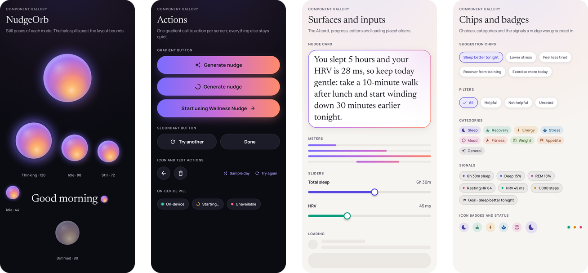

# Daybreak: design notes

Daybreak is the visual system of Wellness Nudge. The app turns last night's signals into one small step for today, so the design is
built around that moment: a calm, dark canvas with the on-device AI drawn as a source of light.

## Principles

1. **One hero per screen.** Today builds toward the Generate button. On the Nudge screen the text is the hero, set large in Newsreader.
   In Journal and For you the entries lead.
2. **The gradient means AI.** The sunrise gradient (iris → orchid → coral → honey) appears only where the model is involved: the orb,
   the Generate button, the nudge card's border and glow, and model-download progress. Ordinary chrome stays neutral.
3. **Honest numbers.** The app shows only values the person entered: no invented trends, scores or "optimal" labels. Sleep moves in
   6-minute steps so "5h 12m" on the card and "5.2 hours" in the nudge always name the same duration.
4. **Private by design, visibly.** The *On-device* pill and the runtime sheet say where things run. Generating says which model runs, and where.
5. **Calm motion.** Eased, slow movement; springs only for tactile feedback.

## Color

Dark is the primary theme; the light theme ("morning paper") follows the system setting.

| Role | Dark | Light |
|---|---|---|
| Canvas | `#0B0B12` ink, with a faint iris/orchid glow at the top | `#F7F5F2` paper, same glow at lower strength |
| Card | `#15151F` + 1 dp white hairline (7%) | `#FFFFFF` + hairline + soft blurred paper shadow |
| Text | `#F5F4FA` / `#A5A3B3` / `#8A889A` | `#16151D` / `#524F5F` / `#686676` |
| Accent | `#A99EFF` | `#5B4BE0` |
| AI gradient | `#7B6CFF` → `#C86DD7` → `#FF8A6B` (→ `#FFC46B` in the orb) | same |

Metrics and goal categories have their own hues, each with a darker light-theme variant: sleep iris, deep sleep blue, REM orchid, resting
heart rate rose, HRV mint, steps honey. Category labels on tinted badges use darker text tones so they reach 4.5:1 contrast in both themes.

## Type

Two bundled families; no downloadable fonts, because the app is offline-first:

- **Newsreader** (display optical size) is the voice of the product: the greeting, screen titles, and the nudge itself at 28 sp.
  Journal previews and For you quotes use it at 18 sp; quotes are set in italic.
- **Manrope** is used for everything else. Metric values are Manrope Medium with tabular figures, so numbers that change in place don't jitter.

## Components

The system lives in `android/app/src/main/java/com/mimik/wellnessnudge/ui/components` and is rendered page by page in
`ComponentGalleryTest`:

- **NudgeOrb**: the AI as light. Five colored lights orbit around a turning warm axis inside a sphere, with a specular highlight, a glassy rim and a halo.
  It is one draw pass with brushes built once per size, so frames only move them. It runs at about 30 fps, including while thinking, because the model
  shares the CPU with rendering: at 120 Hz the thinking orb made nudges take nearly twice as long on a Pixel 9 Pro XL.
  In previews, in snapshot tests and with animations disabled it holds a still pose.
- **GradientButton** for the single primary action per screen; **SecondaryButton** and **CircleIconButton** for everything else.
- **WellnessCard**, **MetricTile**, **SleepStagesBar**, **LinearMeter** and **WellnessSlider** for the signals.
- **CategoryBadge**, **SignalChip** and **SuggestionChip** for goals and the signals a nudge was grounded in.
- **FloatingNavBar**, **OnDevicePill**, **EmptyState** and skeleton loaders.

## Motion

- Tabs crossfade (220 ms); the Nudge screen rises in (350 ms).
- Sample day animates every value over 500 ms.
- A fresh nudge reveals word by word (30 ms stagger). Nudges reopened from the Journal appear whole.
- Feedback buttons use a spring and a haptic tick.
- With Android animations off, the orb holds still and text appears at once.

## Testing the design

Every screen and state is a Paparazzi snapshot in both themes: 63 tests, 126 images. The frames simulate the Pixel's status and gesture bars, so
edge-to-edge insets are tested too. `./gradlew :app:verifyPaparazziDebug` fails on any visual change; re-record with
`./gradlew :app:recordPaparazziDebug`.
